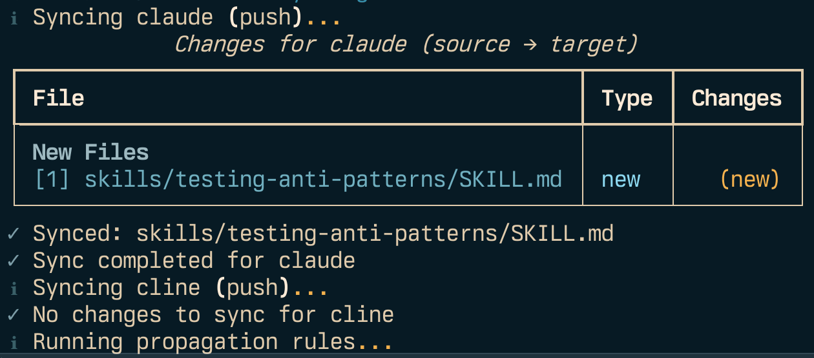

# Agentic Sync

Sync config, rules, workflows, skills and templates across agentic coding tools (Claude Code, Cline, etc.)

- [Agentic Sync](#agentic-sync)
  - [Features](#features)
  - [Installation](#installation)
  - [Quick Start](#quick-start)
  - [Configuration](#configuration)
    - [Example Configuration](#example-configuration)
  - [Terminology](#terminology)
  - [Commands](#commands)
    - [Sync Operations](#sync-operations)
    - [Backup Management](#backup-management)
    - [Configuration](#configuration-1)
  - [Usage Examples](#usage-examples)
    - [Daily Workflow](#daily-workflow)
    - [Multi-Machine Setup](#multi-machine-setup)
    - [Handling Conflicts](#handling-conflicts)
    - [Backup and Restore](#backup-and-restore)
  - [Glob Patterns](#glob-patterns)
  - [Cross-Tool Propagation](#cross-tool-propagation)
    - [Source→Source (Recommended for derived configs)](#sourcesource-recommended-for-derived-configs)
    - [Target→Target (Traditional)](#targettarget-traditional)
    - [Absolute Paths](#absolute-paths)
    - [Available Transformations](#available-transformations)
  - [License](#license)
  - [Related](#related)

## Features

- **Bidirectional sync** between source tool directories and target locations
- **Multi-machine awareness** - tracks sync state across different machines
- **Safe operations** - never overwrites source files without confirmation
- **Point-in-time backups** - create backups before destructive operations
- **Automatic backups** before making changes
- **State tracking** across multiple machines
- **Conflict detection** with manual resolution



## Installation

```bash
# Clone the repository
git clone https://github.com/sammcj/sync-agentic-tools.git
cd sync-agentic-tools

# Optionally switch the latest Python 3.14 version (using whatever tool you prefer)
# pyenv install 3.14 && pyenv local 3.14 # if using pyenv

# Create virtual environment and install
uv venv .venv && source .venv/bin/activate
source .venv/bin/activate
uv pip install -e .
```

## Quick Start

1. **Create a configuration file:**

```bash
sync-agentic-tools init-config
```

This creates `~/.sync-agentic-tools.yaml`. Edit this file to configure your tools.

2. **Check what would be synced (dry run):**

```bash
sync-agentic-tools status
```

3. **Sync your configurations:**

```bash
# Push source changes to target (default)
sync-agentic-tools

# Sync specific tool only
sync-agentic-tools --tool claude

# Pull changes from target to source
sync-agentic-tools --pull

# Bidirectional sync
sync-agentic-tools --bidirectional
```

## Configuration

The configuration file (`~/.sync-agentic-tools.yaml`) defines:

- **Settings**: Global behaviour (backups, safety, etc.)
- **Exclude Rulesets**: Reusable exclude pattern sets (optional)
- **Tools**: Per-tool configuration with paths and patterns
- **Propagation**: Cross-tool file copying with transformations

### Example Configuration

```yaml
# ~/.agentic-sync.yaml
settings:
  # Backup settings
  backup_retention_days: 90          # Keep backups for 90 days
  backup_retention_count: 30         # Keep last 30 backups
  auto_cleanup_backups: true         # Automatically clean old backups
  compress_old_backups: true         # Compress backups older than 7 days
  follow_symlinks: false             # Don't follow symbolic links
  respect_gitignore: true            # Automatically exclude files from .gitignore

  # Safety settings
  confirm_destructive_source: true    # Ask before overwriting source files
  confirm_destructive_target: false   # Don't ask before copying to target
  show_diff_threshold: 1             # Show diff for files larger than 1 lines

  # Behaviour
  detect_renames: true               # Detect when files are renamed
  rename_similarity_threshold: 1.0   # Require 100% match for rename detection

# Reusable exclude pattern rulesets
# Tools can reference these to avoid duplicating common patterns
exclude_rulesets:
  common:
    - "**/.DS_Store"         # Exclude macOS metadata files
    - "**/.vscode/**"        # Exclude VS Code settings
    - "debug/**"             # Exclude debug directory
    - "file-history/**"      # Exclude file history
    - "session-env/**"       # Exclude session environment
    - "**/*.log"             # Exclude all log files
    - "**/*.env"             # Exclude all env files
    - "**/*.tmp"             # Exclude all tmp files
    - "**/*.local.*"         # Exclude all local files
    - "**/temp/**"           # Exclude temp directories
    - "**/*-backup.*"        # Exclude backup files

  private:
    - "skills/private-*/**"  # Exclude private skills

# Tools define named applications to manage synchronisation for
# Propagation rules at the bottom can reference these tools (or use direct file paths)

tools:
  claude:
    enabled: true
    source: ~/.claude
    target: ~/git/sammcj/agentic-coding/Claude # Target can be any location where you want to centralise your agent configs, rules etc

    include:
      - "CLAUDE.md"
      - "skills/**"
      - "commands/**"
      - "agents/**"
      - "settings.json"

    # Reference common rulesets
    exclude_rulesets:
      - common
      - private

    special_handling:
      settings.json:
        mode: extract_keys
        include_keys:
          - "permissions"

  cline:
    enabled: true
    source: ~/Documents/Cline
    target: ~/git/sammcj/agentic-coding/Cline

    include:
      - "Rules/**"
      - "Workflows/**"

    # Reference common rulesets
    exclude_rulesets:
      - common

  # Example: Gemini CLI configuration
  # gemini:
  #   enabled: false
  #   source: ~/.gemini
  #   target: ~/git/sammcj/agentic-coding/Gemini
  #
  #   include:
  #     - "config.yaml"           # Only sync files unique to Gemini
  #
  #   # Use common ruleset
  #   exclude_rulesets:
  #     - common
  #
  #   exclude:
  #     - "**/logs/**"
  #     - "GEMINI.md"             # Exclude - auto-propagated from Claude


# Propagation rules to copy files between tools with transformations
# Supports two modes:
#   1. Tool-based: Uses tool definitions, always syncs target directories
#   2. Absolute paths: Direct file paths for source-to-source copies
#
# IMPORTANT: If propagating to source directories using absolute paths,
# exclude those files from sync to prevent conflicts:
#   exclude:
#     - "GEMINI.md"  # Auto-propagated from Claude
propagate:
  # Tool-based propagation (target → target)
  - source_tool: claude
    source_file: CLAUDE.md
    targets:
      - tool: cline
        target_file: rules/CLINE_RULES.md
        transforms:
          - type: sed
            pattern: 's/Claude/Cline/g'
          - type: remove_xml_sections
            sections:
              - "CLAUDE_PARALLEL_TASKS"

  # Direct propagation (no tool definition needed)
  - source_path: ~/.claude/CLAUDE.md
    targets:
      - dest_path: ~/.gemini/GEMINI.md
        transforms:
          - type: sed
            pattern: 's/Claude Code/Gemini CLI/g'
          - type: sed
            pattern: 's/Claude/Gemini/g'

      - dest_path: ~/.codex/AGENTS.md
        transforms:
          - type: sed
            pattern: 's/Claude Code/Codex/g'
          - type: sed
            pattern: 's/Claude/Codex/g'

      - dest_path: ~/Documents/Cline/Rules/CLINE_RULES.md
        transforms:
          - type: sed
            pattern: 's/Claude/Cline/g'
          - type: remove_xml_sections
            sections:
              - "CLAUDE_PARALLEL_TASKS"

  - source_path: ~/.claude/commands
    exclude:
      - "CLAUDE.md"           # Exclude specific file
      - "*.bak"               # Exclude by pattern
      - "private-*"           # Exclude files starting with "private-"
      - "test/*"              # Exclude files in test directory
    targets:
      - dest_path: ~/Documents/Cline/Workflows
        transforms:
          - type: sed
            pattern: 's/Claude Code/Cline/g'
          - type: sed
            pattern: 's/Claude/Cline/g'

  # Example: Source→Source propagation using absolute paths
  # (For direct local-to-local copies without going through targets)
  # - source_path: ~/.claude/CLAUDE.md
  #   targets:
  #     - dest_path: ~/.gemini/GEMINI.md
  #       transforms:
  #         - type: sed
  #           pattern: 's/Claude Code/Gemini CLI/g'
  #
  #     - dest_path: ~/.codex/AGENTS.md
  #       transforms:
  #         - type: sed
  #           pattern: 's/Claude Code/Codex/g'


  # Example: Mixed - tool-based + absolute paths
  # - source_tool: claude
  #   source_file: skills/shell-scripting.md
  #   targets:
  #     - tool: cline
  #       target_file: Rules/shell-scripting.md  # Tool-based (target dir)
  #
  #     - dest_path: ~/.codex/shell.md          # Absolute path (direct)
  #       transforms:
  #         - type: sed
  #           pattern: 's/Claude/Codex/g'

```

## Terminology

Key terms and concepts used in agentic-sync:

- **tool**: A named agentic coding application defined in the `tools` section (e.g., `claude`, `cline`). Each tool has a `source` directory (where files live on your machine) and a `target` directory (where they're synchronised to).
- **source** vs **target**: Two different locations for the same tool's files:
  - `source`: The working directory on your machine (e.g., `~/.claude`)
  - `target`: The destination directory (e.g., `~/git/sammcj/agentic-coding/Claude`)
  - Sync operations copy files between these two locations
- **base**: In propagation rules, specifies whether to use a tool's `source` or `target` directory. Default is `target`.
- **propagation**: Automatically copying files from one tool to another with optional transformations (e.g., copying CLAUDE.md to GEMINI.md with text replacements). Can be:
  - Tool-relative: Uses tool definitions with `source_tool`/`tool` + `base` parameters
  - Absolute: Uses direct file paths with `source_path`/`dest_path` parameters
- **pattern** (glob pattern): File matching pattern used in `include`/`exclude` lists:
  - `*` matches any characters in a single directory
  - `**` matches any number of directory levels recursively
  - Example: `skills/**` matches all files under `skills/` directory
- **special_handling**: Per-file rules for syncing only specific parts of a file. Currently supports `extract_keys` mode to sync only specific JSON keys (e.g., only sync the `permissions` key from `settings.json`).
- **show_diff_threshold**: Number of lines above which diffs are displayed when syncing modified files. Set to `1` to always show diffs, or higher values to only show for large changes.
- **rename_similarity_threshold**: Threshold (0.0-1.0) for detecting file renames. Set to `1.0` (default) to require exact content match, or lower values to detect renames of similar files. Used to avoid treating renames as delete+add operations.
- **transform**: Modification applied during propagation:
  - `sed`: Regex find-and-replace (e.g., `s/Claude/Cline/g`)
  - `remove_xml_sections`: Remove XML-tagged sections (e.g., `<SECTION_NAME>...</SECTION_NAME>`)

## Commands

### Sync Operations

```bash
# Default: push source → target
sync-agentic-tools

# Push mode (explicit)
sync-agentic-tools --push

# Pull mode (target → source)
sync-agentic-tools --pull

# Bidirectional sync
sync-agentic-tools --bidirectional

# Sync specific tool
sync-agentic-tools --tool claude

# Dry run (see what would happen)
sync-agentic-tools --dry-run

# Auto-resolve conflicts
sync-agentic-tools --auto

# Check status without changes
sync-agentic-tools status
```

### Backup Management

```bash
# List available backups
sync-agentic-tools list-backups

# List backups for specific tool
sync-agentic-tools list-backups --tool claude

# Restore from backup
sync-agentic-tools restore <backup-id>

# Clean up old backups
sync-agentic-tools clean-backups
```

### Configuration

```bash
# Create template config
sync-agentic-tools init-config

# Use custom config file
sync-agentic-tools --config /path/to/config.yaml

# Overwrite existing config
sync-agentic-tools init-config --force
```

## Usage Examples

### Daily Workflow

```bash
# Check what's changed
sync-agentic-tools sync status

# Sync all tools (push source → target)
sync-agentic-tools sync

# Sync specific tool only
sync-agentic-tools sync --tool claude
```

### Multi-Machine Setup

**Machine 1 (initial push):**
```bash
sync-agentic-tools sync
```

**Machine 2 (pull and ongoing sync):**
```bash
# First time: pull from target
sync-agentic-tools sync --pull

# Ongoing: bidirectional sync
sync-agentic-tools sync --bidirectional
```

### Handling Conflicts

When both source and target have changed:
```
CONFLICT: CLAUDE.md
  Source: modified 2025-01-15 10:30
  Target: modified 2025-01-15 10:25

[K]eep source / [U]se target / [D]iff / [S]kip / [A]uto (newer wins)
```

- Press `d` to see the diff
- Press `k` to keep source version (push to target)
- Press `u` to use target version (overwrite source)
- Press `a` to auto-choose based on timestamps

### Backup and Restore

```bash
# List backups
sync-agentic-tools list-backups

# Restore if something went wrong
sync-agentic-tools restore <backup-id>
```

## Glob Patterns

The tool supports powerful glob patterns for including/excluding files:

- `*` - Match any characters in single directory level
- `**` - Match any number of directory levels
- `*.md` - Match files with specific extension
- `skills/**` - Match all files under skills/ recursively
- `**/.DS_Store` - Match .DS_Store in any directory

## Cross-Tool Propagation

Propagation allows copying files between tools with optional transformations. Supports three modes:

### Source→Source (Recommended for derived configs)

Copy files directly between tools' source directories using absolute paths:

```yaml
propagate:
  - source_path: ~/.claude/CLAUDE.md
    targets:
      - dest_path: ~/.gemini/GEMINI.md
        transforms:
          - type: sed
            pattern: 's/Claude Code/Gemini CLI/g'
```

**Benefits:**
- Fast (no target intermediate step)
- Direct source-to-source sync
- Perfect for maintaining tool-specific versions of a source-of-truth file

**Important:** Exclude propagated files from sync to prevent conflicts:
```yaml
tools:
  gemini:
    exclude:
      - "GEMINI.md"  # Auto-propagated from Claude
```

### Target→Target (Traditional)

Copy files between tools' target directories:

```yaml
propagate:
  - source_tool: claude
    source_file: CLAUDE.md
    targets:
      - tool: cline
        target_file: rules/CLINE_RULES.md
```

### Absolute Paths

Bypass tool configuration entirely:

```yaml
propagate:
  - source_path: ~/.claude/CLAUDE.md
    targets:
      - dest_path: /some/other/location/config.md
```

### Available Transformations

- **sed**: Regex find-and-replace
  ```yaml
  transforms:
    - type: sed
      pattern: 's/Claude/Cline/g'
  ```

- **remove_xml_sections**: Remove XML-tagged sections
  ```yaml
  transforms:
    - type: remove_xml_sections
      sections:
        - "CLAUDE_PARALLEL_TASKS"
        - "TOOL_SPECIFIC_SECTION"
  ```

---

## License

[MIT](LICENSE)

## Related

- [sammcj/agentic-coding](https://github.com/sammcj/agentic-coding) - Collection of rules and configurations for agentic coding tools
